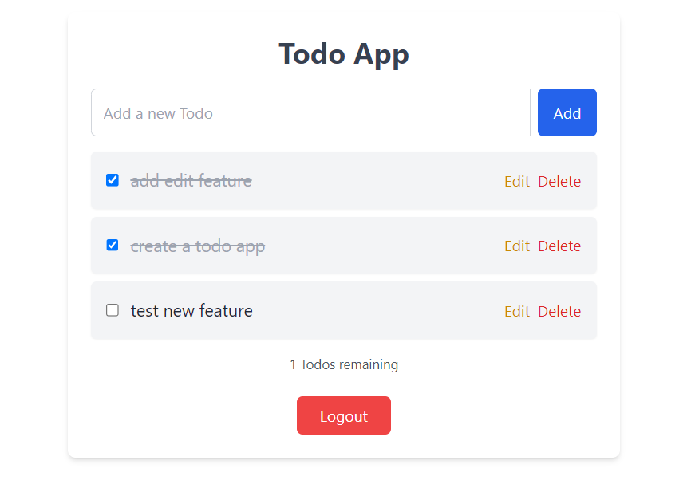

# TODO List Web App | MERN 

A Todo list web application built using the MERN stack (MongoDB, Express, React, Node.js), featuring user authentication (signup, login) and JWT-based authentication and authorization.

## Features

- **Login/Signup:** A login page for users to authenticate and access their profile.
- **Dashboard:** Manage and view your Todo tasks.
- **User Access Control:** JWT-based user authentication and authorization.

### Prerequisites

Make sure you have the following installed:

- [Node.js](https://nodejs.org/) (which includes npm)
- [MongoDB](https://www.mongodb.com/) (running locally or provide a connection string)

A full-stack Todo App that allows users to:

- ✅ Add new todos
- 📝 Edit existing todos
- ❌ Delete todos
- ☑️ Mark todos as complete/incomplete
- 🔒 Logout from session
- 👤 View tasks specific to each logged-in user

---

## 🌐 Live Demo

👉 [Live Link Here](https://your-deployed-app-url.com)  
*(Replace with your deployed link)*

---

## 🚀 Features

- Simple, clean, modern UI (fully responsive)
- User authentication (login/signup/logout)
- Each user has a personal todo list (data isolated by user)
- Edit/Delete each task
- Filter tasks (Completed/Uncompleted)
- Task count display
- Logout securely

---

## 🛠️ Tech Stack

- **Frontend**: React.js, CSS  
- **Backend**: Node.js, Express.js  
- **Database**: MongoDB  
- **Auth**: JWT (JSON Web Tokens)  
- **Deployment**: [Vercel / Netlify / Render / Railway / Heroku] *(choose one you used)*

---

## 📐 Architecture Diagram

  
*(Replace with your own architecture diagram image)*

---

## 🧪 Setup Instructions

# 1. Clone the repo
git clone https://github.com/your-username/todo-app.git

# 2. Navigate to project folder
cd todo-app

# 3. Install dependencies
npm install

# 4. Start frontend
cd client
npm install
npm start

# 5. Start backend
cd server
npm install
npm run dev
🎥 Demo Walkthrough
👉 Loom Video Link
(Replace with your loom demo walkthrough link)

📌 Assumptions Made
The app assumes users are required to login to view or modify todos.

Todos are private to each user and stored using user-specific filtering via MongoDB.

User sessions are maintained using JWT tokens.

🧠 AI Tools Used
ChatGPT: Used for:

Component structure ideas

CSS refinement

Debugging REST APIs

Loom: For demo recording

Prompt history and usage will be presented during the final interview if requested.

🕒 Timeframe
Started: July 5th, 2025

Submitted: July 6th, 2025 (within 48 hours)

🏁 Final Notes
This project is a part of a hackathon run by
https://www.katomaran.com

---

